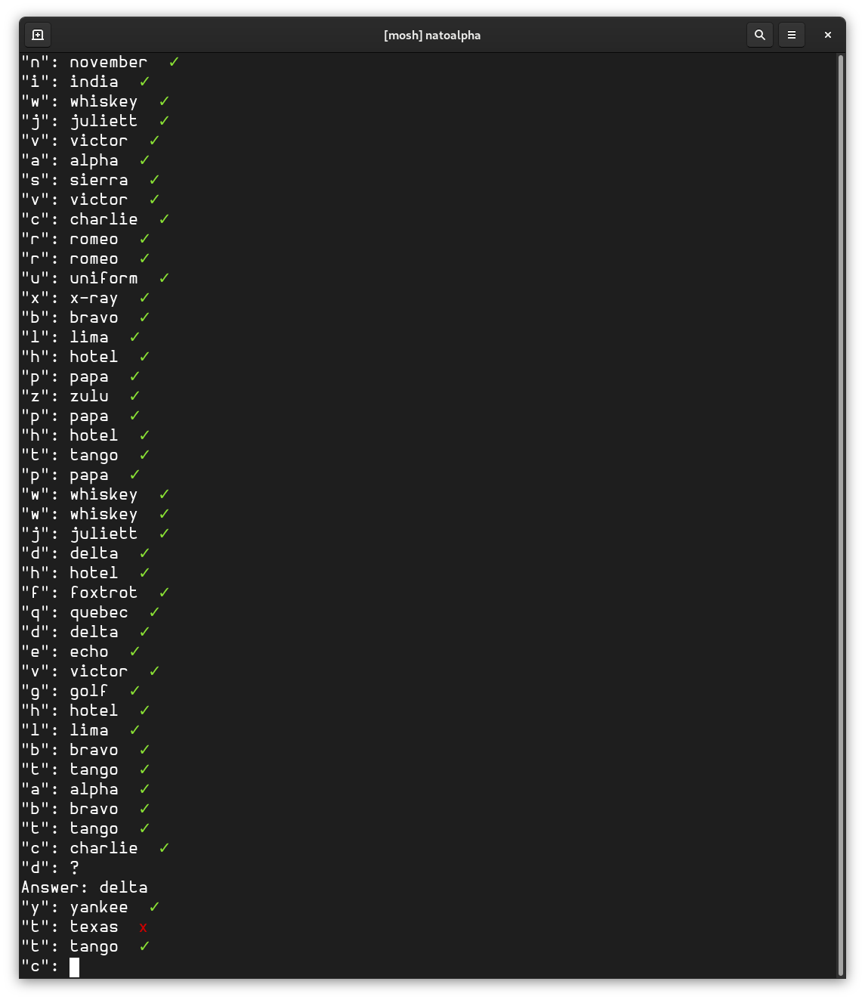

# quizkit

Quizkit is a small library for writing CLI-based quizzes. Good for spacial repetition. 

## Building
Build with `cargo build`

## Examples
Run one of the examples via `cargo run --example [example_name]`

If you don't know the answer to one of the prompts, you can enter '?' to have it printed. 

### natoalpha

natoalpha is a small program to help me learn the NATO Alphabet. 

### addition

addition quiz example that uses arithmetic as an example. 

